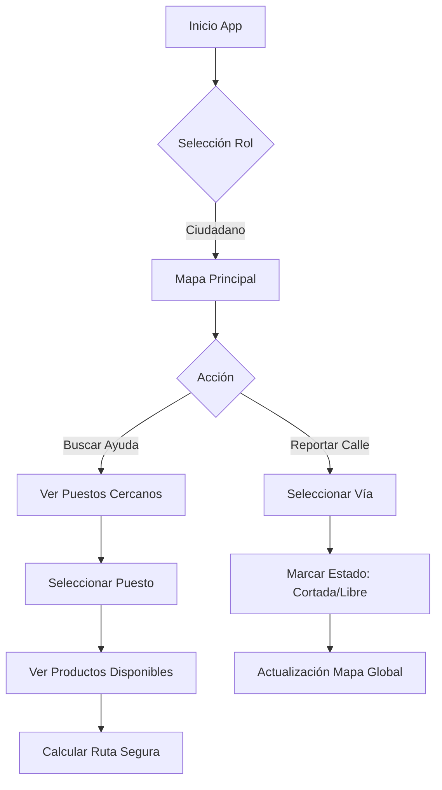

# Rol: Ciudadano - Informador y Beneficiario

## Descripción General

El rol de **Ciudadano** es fundamental para la inteligencia colectiva del sistema y para facilitar el acceso a la ayuda. Los ciudadanos no solo pueden ser beneficiarios de la ayuda, sino que actúan como "sensores" en terreno para alertar sobre el estado de las vías y la situación en tiempo real.

## Selección de Rol

Al iniciar la aplicación, el usuario puede seleccionar explícitamente el perfil de **Ciudadano**. Esto habilita una interfaz simplificada centrada en:
1.  Localizar ayuda (Puestos de Emergencia).
2.  Consultar estado de carreteras.
3.  Reportar incidencias en vías.

## Funcionalidades Principales

### 1. Búsqueda de Catástrofe y Puestos Cercanos

**Funcionalidad:**
- Al seleccionar una catástrofe activa, el mapa centra la vista en la ubicación del ciudadano.
- Se muestran automáticamente los **Puestos de Emergencia** más cercanos.

**Información del Puesto:**
Al pulsar sobre un puesto en el mapa, el ciudadano puede ver:
- **Nombre y Ubicación**.
- **Distancia** y tiempo estimado a pie o en vehículo.
- **Inventario de Productos**:
    - Qué productos ofrece (Agua, comida, ropa, etc.).
    - Disponibilidad actual (Alta, Media, Baja).

### 2. Navegación y Rutas Seguras

**Cálculo de Ruta:**
- La aplicación traza la ruta más segura desde la ubicación del ciudadano hasta el puesto seleccionado.
- El algoritmo de enrutamiento tiene en cuenta **bloqueos reportados** por otros usuarios para evitar calles cortadas o peligrosas.

### 3. Reporte de Estado de Vías (Crowdsourcing)

Esta es una función crítica donde la comunidad mantiene el mapa actualizado.

#### Reportar Vía Cortada
Si un ciudadano encuentra una calle bloqueada:
1.  Pulsa sobre el tramo de calle en el mapa.
2.  Selecciona "Reportar Incidencia".
3.  Tipo de incidencia:
    - 🚧 **Cortada**: Escombros, policía, agujeros.
    - 🌊 **Inundada**: Agua alta, barro.
    - ⛔ **Peligrosa**: Cables caídos, riesgo de derrumbe.
4.  (Opcional) Añadir foto o comentario breve.
5.  **Efecto**: La ruta se marca en rojo para todos los usuarios y el GPS de los voluntarios evitará esta zona.

#### Reportar Vía Despejada
Si una calle previamente marcada como cortada ya es transitable:
1.  Pulsa sobre la incidencia en el mapa.
2.  Selecciona "Marcar como Transitable".
3.  **Efecto**: Tras la validación (por varios reportes o un moderador), la calle vuelve a estar disponible para el cálculo de rutas.

## Flujo de Interacción

## Beneficios

1.  **Información Veraz**: Los ciudadanos locales conocen el terreno mejor que nadie.
2.  **Eficiencia Logística**: Evita que voluntarios y otros ciudadanos pierdan tiempo o corran riesgos intentando pasar por calles bloqueadas.
3.  **Acceso a la Ayuda**: Facilita a las víctimas encontrar exactamente lo que necesitan sin desplazamientos innecesarios.

## Requisitos Técnicos

-   **Geolocalización**: Permiso para ver la ubicación y calcular rutas.
-   **Conexión**: Para recibir actualizaciones de stock y enviar reportes de vías (con soporte offline para guardar reportes y enviarlos al recuperar conexión).
