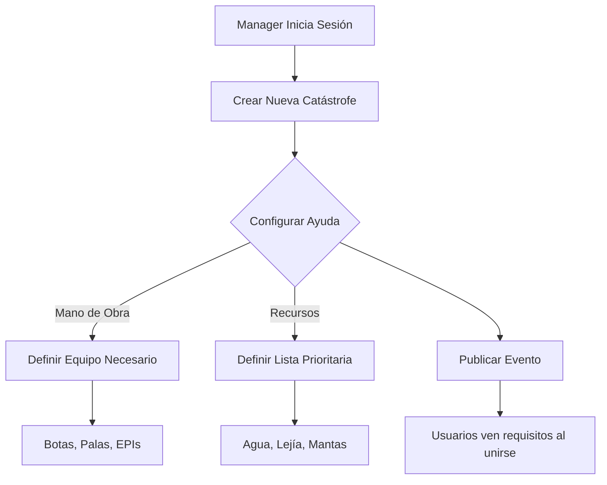

# Rol: Manager - Coordinador de Catástrofe

## Descripción General

El **Manager o Coordinador** es el rol de mayor jerarquía operativa en el sistema. Es el encargado de dar de alta la emergencia y definir la estrategia global de respuesta. Su función no es mover cajas, sino **orquestar la logística** y asegurar que la ayuda solicitada sea exactamente la que se necesita en cada fase de la crisis.

## Funcionalidades Principales

### 1. Creación y Configuración de la Catástrofe

**Funcionalidad:**
- **Alta de Evento**: Define el nombre (ej: "DANA Valencia Oct 2024"), tipo de catástrofe y zona geográfica afectada (polígono en mapa).
- **Tipología de Ayuda**: Configura qué líneas de ayuda están abiertas.
    - ✅ **Bienes y Recursos**: Comida, ropa, herramientas, maquinaria pesada.
    - ✅ **Mano de Obra**: Voluntarios para limpieza, desescombro, asistencia médica.

### 2. Definición de Necesidades Específicas

El Manager especifica los requisitos para cada tipo de ayuda activada para maximizar la eficiencia y seguridad.

#### Gestión de Mano de Obra (Voluntarios)
Si se solicita personal, el Manager define:
- **Perfil Solicitado**: Médicos, bomberos, ingenieros, o ciudadanos generales.
- **Equipo Recomendado**: Lista de items que el voluntario debe traer para ser útil y estar seguro.
    - *Ejemplo*: "Botas de agua altas, mascarilla ffp2, guantes de corte, pala propia".
- **Instrucciones de Seguridad**: Protocolos obligatorios antes de entrar a la zona (ej: "Vacuna del tétanos obligatoria").

#### Gestión de Recursos (Donaciones)
Si se solicitan bienes, el Manager establece:
- **Lista de Prioridades**: Qué se necesita URGENTE y qué NO se necesita (para evitar saturación de ropa usada, por ejemplo).
- **Logística de Entrega**: Puntos de acopio masivo o instrucciones de empaquetado (ej: "Agua en palets, no botellas sueltas").

### 3. Coordinación General

- **Actualización de Estado**: Cambiar la fase de la emergencia (ej: De "Rescate" a "Limpieza" y luego a "Reconstrucción").
- **Mensajes Globales**: Enviar notificaciones push a todos los usuarios de la zona (Voluntarios, Ciudadanos y Puestos) con alertas oficiales o cambios de estrategia.

## Flujo de Interacción

## Beneficios del Rol

1.  **Filtro de Calidad**: Evita que lleguen voluntarios sin el equipo adecuado (ej: gente en zapatillas al barro), lo que suele generar más problemas que ayuda.
2.  **Dirección Unificada**: Evita informaciones contradictorias; el Manager marca la "verdad oficial" de la necesidad actual.
3.  **Adaptabilidad**: Permite cambiar lo que se pide en cuestión de segundos según evolucione la catástrofe.

## Requisitos Técnicos

-   **Panel de Administración**: Interfaz web/móvil avanzada con permisos de "Superusuario".
-   **Validación Oficial**: Este rol requiere una verificación estricta (o ser asignado por autoridades/organizaciones certificadas) para evitar caos por mala gestión.
