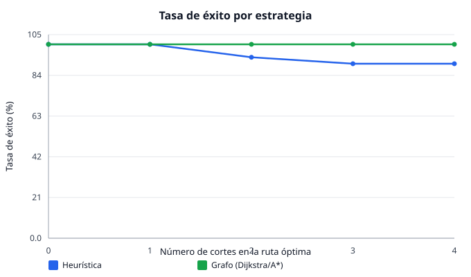
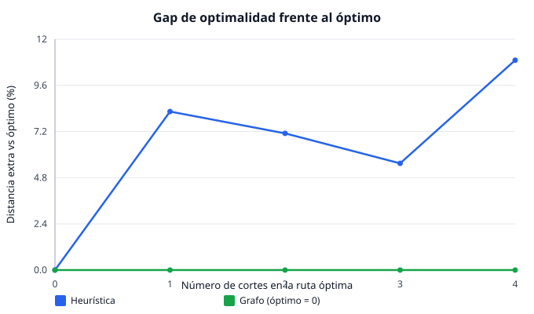
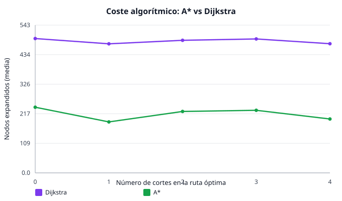
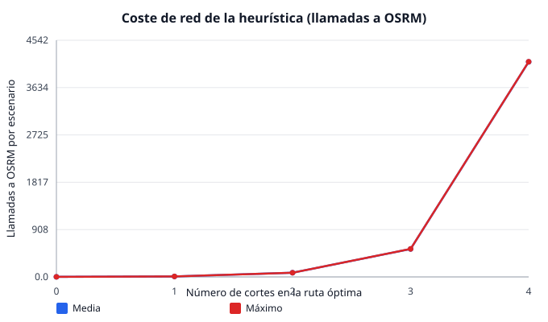

# Comparativa de algoritmos de enrutamiento que evitan vías cortadas

> Generado automáticamente por `npm run bench`. No editar a mano.

Se comparan tres estrategias sobre los **mismos** escenarios:

1. **Heurística (actual)** — [`routing.ts`](../src/utils/routing.ts): pide rutas a
   OSRM e inserta waypoints de desvío hasta esquivar los cortes.
2. **Grafo · Dijkstra** — [`graphRouting.ts`](../graphRouting.ts): ruta óptima
   sobre el grafo de calles excluyendo las aristas cortadas.
3. **Grafo · A*** — igual que Dijkstra pero con heurística haversine admisible
   (misma distancia óptima, menos nodos explorados).

## Metodología

Entorno **determinista y offline**: rejilla de 25 × 25 cruces (aristas
ponderadas por distancia haversine real, centro en Paiporta) como red de calles.
El mock de OSRM resuelve el camino más corto sobre esa rejilla sin conocer los
cortes (igual que OSRM real). Por cada densidad se generan
**30 escenarios** con semilla fija (`seed = 20241029`),
inyectando los cortes **sobre la ruta óptima** origen→destino (caso exigente).

**Métricas:** *tasa de éxito* (ruta con 0 cortes cruzados), *rodeo* (% extra
frente a la ruta directa), *gap de optimalidad* (% extra frente a la ruta óptima
consciente de cortes = referencia del grafo), y *coste* (llamadas a OSRM para la
heurística; expansiones de nodos para el grafo).

## Comparativa directa

| Cortes | Éxito heur. | Éxito grafo | Gap heur. vs óptimo | OSRM (heur.) | Expansiones A* | Expansiones Dijkstra | Speedup latencia (heur./A*) |
| ---: | ---: | ---: | ---: | ---: | ---: | ---: | ---: |
| 0 | 100.0 % | 100.0 % | 0.0 % | 1.0 | 241.3 | 493.7 | ×1.2 |
| 1 | 100.0 % | 100.0 % | 8.2 % | 9.0 | 187.3 | 474.2 | ×5.2 |
| 2 | 93.3 % | 100.0 % | 7.1 % | 80.8 | 225.8 | 487.3 | ×49.2 |
| 3 | 90.0 % | 100.0 % | 5.5 % | 535.7 | 229.9 | 492.2 | ×319.4 |
| 4 | 90.0 % | 100.0 % | 10.9 % | 4126.5 | 198.0 | 474.7 | ×2297.4 |

## Resultados por estrategia

### Heurística (desvíos vía OSRM)

| Cortes | T. éxito | Rodeo medio | Gap óptimo | Llamadas OSRM (media/máx) | Latencia (ms) |
| ---: | ---: | ---: | ---: | ---: | ---: |
| 0 | 100.0 % | 0.0 % | 0.0 % | 1.0 / 1 | 0.42 |
| 1 | 100.0 % | 8.2 % | 8.2 % | 9.0 / 9 | 2.41 |
| 2 | 93.3 % | 8.7 % | 7.1 % | 80.8 / 81 | 20.74 |
| 3 | 90.0 % | 5.5 % | 5.5 % | 535.7 / 537 | 168.41 |
| 4 | 90.0 % | 12.7 % | 10.9 % | 4126.5 / 4129 | 1619.99 |

### Grafo · Dijkstra

| Cortes | T. éxito | Rodeo medio | Gap óptimo | Expansiones (media/máx) | Latencia (ms) |
| ---: | ---: | ---: | ---: | ---: | ---: |
| 0 | 100.0 % | 0.0 % | 0.0 % | 493.7 / 624 | 0.50 |
| 1 | 100.0 % | 0.0 % | 0.0 % | 474.2 / 617 | 0.65 |
| 2 | 100.0 % | 1.2 % | 0.0 % | 487.3 / 622 | 0.46 |
| 3 | 100.0 % | 0.0 % | 0.0 % | 492.2 / 621 | 0.68 |
| 4 | 100.0 % | 1.2 % | 0.0 % | 474.7 / 624 | 0.79 |

### Grafo · A*

| Cortes | T. éxito | Rodeo medio | Gap óptimo | Expansiones (media/máx) | Latencia (ms) |
| ---: | ---: | ---: | ---: | ---: | ---: |
| 0 | 100.0 % | 0.0 % | 0.0 % | 241.3 / 558 | 0.35 |
| 1 | 100.0 % | 0.0 % | 0.0 % | 187.3 / 437 | 0.47 |
| 2 | 100.0 % | 1.2 % | 0.0 % | 225.8 / 515 | 0.42 |
| 3 | 100.0 % | 0.0 % | 0.0 % | 229.9 / 493 | 0.53 |
| 4 | 100.0 % | 1.2 % | 0.0 % | 198.0 / 561 | 0.71 |

## Figuras

## Análisis: ventajas y desventajas

### Heurística (desvíos vía OSRM) — la implementación actual

**Ventajas**
- **No necesita el grafo de calles en local:** delega el enrutamiento real en
  OSRM. Footprint de datos mínimo, ideal para una PWA offline-first que no puede
  embarcar un extracto OSM completo.
- Reaprovecha un motor de rutas maduro (restricciones de giro, sentidos, perfiles
  *driving*/*foot*) sin reimplementarlo.

**Desventajas**
- **No garantiza optimalidad:** explora desvíos predefinidos; la ruta resultante
  puede alejarse del óptimo (ver columna *gap*).
- **Coste de red que crece de forma combinatoria** con el número de cortes
  (waypoints de desvío × combinaciones): es el principal cuello de botella y, en
  campo, depende de la conectividad —justo lo que falla en una catástrofe—.
- Puede **no encontrar ruta** aunque exista (cae por debajo del 100 % de éxito).

### Grafo (Dijkstra / A*) — la propuesta

**Ventajas**
- **Óptima por construcción:** Dijkstra/A* devuelven la ruta más corta que
  respeta los cortes (gap de optimalidad = 0).
- **Cero llamadas externas:** todo el cálculo es local → funciona sin red, que es
  el escenario objetivo del proyecto.
- **Coste predecible y bajo:** lineal-logarítmico en el tamaño del grafo, estable
  frente al número de cortes (a diferencia de la explosión de la heurística).
- **A*** reduce las expansiones frente a Dijkstra manteniendo la optimalidad.
- Soporta **penalización blanda** de aristas cortadas (cruzar un corte solo si no
  hay alternativa) → nunca deja al usuario sin ruta.

**Desventajas**
- **Requiere el grafo de calles en local** (extracto OSM, almacenamiento y
  actualización): es el coste real de adoptarla.
- Reimplementar restricciones de tráfico (giros, sentidos) tiene complejidad
  propia; el benchmark usa una rejilla no dirigida.

### Conclusión

El grafo gana en **optimalidad, coste y disponibilidad offline**; la heurística
gana en **simplicidad de datos**. Para el dominio del proyecto —operación sin red
durante catástrofes— el enfoque de grafo (con penalización blanda como red de
seguridad) es preferible, asumiendo el coste de embarcar el mapa de la zona
afectada. Una arquitectura híbrida (grafo local cuando hay mapa, OSRM cuando hay
red) captura lo mejor de ambos.
